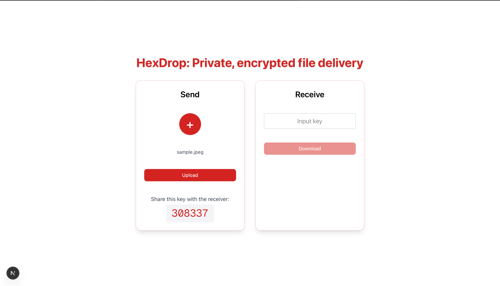

# HexDrop

HexDrop is a secure file-sharing web application built as a **DevOps capstone project** to practice containerization, orchestration, and cloud infrastructure.

## Project Overview

The application lets users upload files, receive a shareable key, and download files using that key. It is built with Next.js and TypeScript, uses PostgreSQL (with Prisma) for metadata, and stores files in **AWS S3** with encryption.

This project was undertaken to learn and apply **DevOps practices**:

- **Docker** — Containerizing the application with a multi-stage Dockerfile
- **Kubernetes** — Deploying and running the app on **Amazon EKS** (managed Kubernetes), with Deployments, Services, Ingress, HPA, and External Secrets
- **AWS** — Using **EC2** (where applicable), **EKS** for the cluster, **S3** for object storage, **RDS** for PostgreSQL, and IAM/security integration
- **CI/CD** — GitHub Actions workflows for build and deploy
- **Infrastructure as Code** — Kubernetes manifests and automation scripts for provisioning and configuring AWS resources

The goal was to go from a working app to a production-style deployment on AWS using containers and Kubernetes, rather than to document how others can run the project locally or elsewhere.

## Screenshots

### Frontend

### Architecture Overview

### GitHub Actions Overview

### Workflow History

### Build and Test

### Build and Push to ECR

### Deploy to EKS

